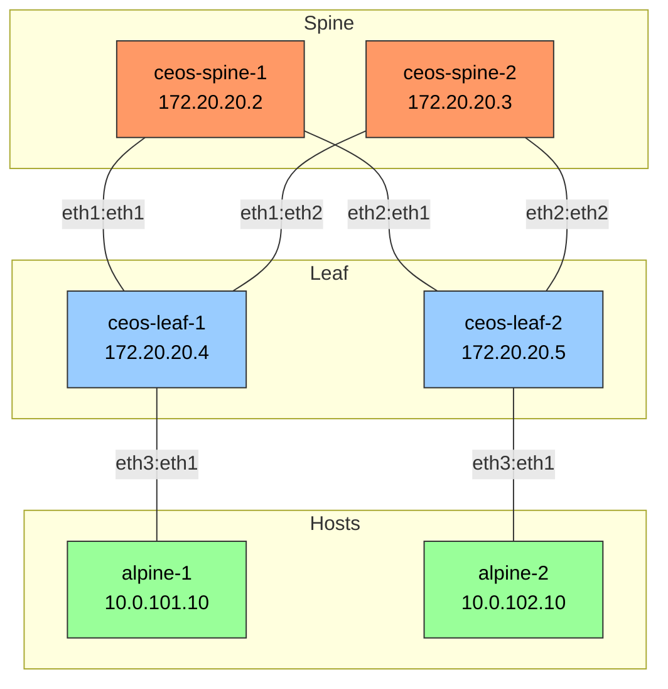

# Arista EOS gNMI Assistant

A Streamlit-based application for managing Arista network devices using gNMI (gRPC Network Management Interface) with natural language processing capabilities through Azure OpenAI. gNMI offers significant advantages over traditional SSH-based management, including:
- Programmatic automation with structured data models
- Efficient, streaming-based communication
- Scalable concurrent operations
- Standardized data modeling through YANG
- Real-time state synchronization
- Reduced operational overhead

## Features

- Natural language interface for network configuration, troubleshooting and administration
- Support for gNMI operations (GET, SET)
- Supports CLI path command execution and OpenConfig paths through gNMI
- Supports Arista EOS native paths through gNMI
- Interrogate and configure multiple devices simultaneously using concurrent sessions
- Real-time feedback and status updates
- Secure credential management
- Automatic timestamp conversion to AEDT
- Human-readable uptime formatting
- YANG model discovery
- Jinja2 Template-based configuration

## Azure OpenAI Setup

This project requires an Azure Account and proper setup in Azure AI Foundry:

1. Navigate to [Azure AI Foundry](https://ai.azure.com) and create a new project
2. Go to Model Catalog and deploy the gpt-4o-mini (version:2024-07-18) model
3. Enter the Assistants Playground and create a new Assistant:
   - Give the Assistant a name
   - Select your deployed model in the Deployment drop-down
   - Set temperature to 0.01
   - Set Top P to 1
   - Paste the instructions from Assistant_Instructions.txt into the Instructions window
4. Navigate to Vector Stores:
   - Click Add Store and name your new Vector Store
   - From the /resources folder, upload:
     - Arista_EOS_4.33.0F_Sample Configurations.docx
     - Arista_EOS_4.33.0F-User-Manual.pdf
     - all_paths.txt
5. Return to Assistants:
   - Enable File Search under Tools and select your vector store
   - Enable Code Interpreter
   - Click Add Function and paste the contents of each schema file:
     - /schemas/apply_cli_commands.json
     - /schemas/read_template.json
     - /schemas/gnmi_get.json
     - /schemas/gnmi_configure.json
   - Verify the Playground UI saves your changes after each modification

## Setup your .env file

- Refer to the screenshot "Azure_OpenAI_Resource.png" to help you navigate to your project variables. These can be revealed by clicking the downward facing arrow at the top right of the Playground window next to your Project Name.
- Copy the endpoint and use it for the AZURE_OPENAI_ENDPOINT environment variable
- Copy the key and use it for the AZURE_OPENAI_API_KEY environment variable
- Copy your Assistant ID from the Assistants Setup window and use it for the AZURE_OPENAI_ASSISTANT_ID environment variable


## Network Environment Requirements

- The host running this application must have network reachability to the network management VRF
- Port 6030 on Arista devices (gNMI) must be accessible and not blocked by firewalls/ACLs
- All testing has been done with Arista cEOS Lab 4.33.0F (downloadable for free by registering on arista.com)
- Recommended test environment: cEOS 4.33.0F running in Containerlab

Required Arista EOS gNMI configurations:
```
management api gnmi
   transport grpc default
   provider eos-native
   operation set persistence
!
management api models
   provider aft
      ipv4-unicast
   !
   provider configuration
      updates
      history limit 10
!
management api netconf
   transport ssh default
```

Note: To support the eos-native provider path, SSH to the EOS device and shut/no shut the grpc transport:
```
ceos-leaf-1#conf t
ceos-leaf-1(config)#management api gnmi
ceos-leaf-1(config-mgmt-api-gnmi)#transport grpc default
ceos-leaf-1(config-gnmi-transport-default)#shut
ceos-leaf-1(config-gnmi-transport-default)#no shut
```

## Dependencies

All dependencies are listed in requirements.txt. Key dependencies include:

```
streamlit>=1.29.0
openai>=1.6.1
python-dotenv>=1.0.0
pandas>=2.1.4
pygnmi>=0.8.13
pyyaml>=6.0.1
dictdiffer>=0.9.0
pytz>=2023.3
```

## Installation

### Windows

1. Clone the repository:
```bash
git clone https://github.com/admatt01/Arista-AI_Assistant.git
cd Arista-AI_Assistant
```

2. Create and activate a virtual environment (recommended):
```bash
python -m venv venv
venv\Scripts\activate
```

3. Install dependencies:
```bash
pip install -r requirements.txt
```

### Linux (Debian/Ubuntu)

1. Install system dependencies:
```bash
sudo apt-get update
sudo apt-get install -y python3-pip python3-venv libssl-dev libffi-dev python3-dev
```

2. Clone the repository:
```bash
git clone https://github.com/admatt01/Arista-AI_Assistant.git
cd Arista-AI_Assistant
```

3. Create and activate a virtual environment:
```bash
python3 -m venv venv
source venv/bin/activate
```

4. Install Python dependencies:
```bash
pip install --upgrade pip
pip install -r requirements.txt
```

### Configuration

1. Edit the hosts.json file, adding devices you want to manage:
```json
{
  "devices": {
    "ceos-spine-1": {
      "hostname": "ceos-spine-1",
      "target": "172.20.20.2:6030",
      "username": "admin",
      "password": "admin",
      "description": "Arista EOS Spine Switch 1"
    },
    "ceos-spine-2": {
      "hostname": "ceos-spine-2", 
      "target": "172.20.20.3:6030",
      "username": "admin",
      "password": "admin",
      "description": "Arista EOS Spine Switch 2"
    },
    "ceos-leaf-1": {
      "hostname": "ceos-leaf-1",
      "target": "172.20.20.4:6030",
      "username": "admin",
      "password": "admin",
      "description": "Arista EOS Leaf Switch 1"
    },
    "ceos-leaf-2": {
      "hostname": "ceos-leaf-2", 
      "target": "172.20.20.5:6030",
      "username": "admin",
      "password": "admin",
      "description": "Arista EOS Leaf Switch 2"
    }
  }
}
```

1. Create a .env file with your Azure OpenAI credentials:
```bash
AZURE_OPENAI_ENDPOINT=your_Azure_OpenAI_endpoint
AZURE_OPENAI_API_KEY=your_Azure_OpenAI_api_key
AZURE_OPENAI_ASSISTANT_ID=your_Azure_OpenAI_assistant_id
```

## Working with Jinja2 Templates

The Assistant can help automate your Arista network configuration using Jinja2 templates and CSV parameter files:

1. Create a Jinja2 Template:
   - Request a template from the Assistant based on your target device's running configuration
   - Copy the template to /device_config_templates/[template_name].jinja2

2. Produce and Save Template Variables:
   - Copy the Assistant-provided CSV format variables/parameters
   - Save as /device_config_templates/[device_hostname]-template_values.csv
   - Create parameters CSV files for additional devices as required for use with the templates when you need to add new devices to your network

3. Access Available Templates:
   - Templates appear in the "Available Templates" section on the Streamlit sidebar
   - The Assistant can use these for rendering configurations
   - Restart your Streamlit session if the templates don't appear in the "Available Templates" section after uploading
   - You can ask the Assistant to display any of the templates and their variables requirements for any template visible in the "Available Templates" section on the Streamlit sidebar

4. Render a Configuration:
   - Upload your template parameters CSV to the Assistant's code-interpreter using "Upload Parameters CSV" in the Parameters File Upload section on the Streamlit sidebar.
   - Request the Assistant to render the configuration using your template and variables

5. Push configurations to the devices:
   - Once rendered you can instruct the Assistant to push the configuration to the device
   - You can render multiple configurations by uploading mutiple parameters CSV files to the Assistant using the File Uploader in the Streamlit sidebar and instructing the Assistant to render multiple configurations and bulk push them to the associated Arista devices

Note: Templates are available to the Assistant's code-interpreter during the current session.

### Running the Application

#### Windows
```bash
streamlit run Arista_EOS_Assistant.py
```

#### Linux
```bash
# Make sure you're in the virtual environment
source venv/bin/activate
streamlit run Arista_EOS_Assistant.py
```

The application will be available at http://localhost:8501 by default.

## Screenshots and examples

A far from exhaustive list of prompts with examples of the Assistant's capabilities can be found in the screenshots folder. The Assistant is particulary powerful when used to query multiple devices concurrently, e.g:
 - "show me the BGP routes on all four devices" 
 - "show me Tx packets for ethernet1 on ceos-leaf-1 and Rx packets for ethernet1 on ceos-spine-1"
 - "add a static route for 172.27.1.0/24 next-hop 10.0.0.1 on ceos-leaf-1. For ceos-leaf-2 add the same route with next-hop 10.0.0.5. Please confirm the task before proceeding."

There are thousands of possibilities. Be imaginative and explore the Assistant's capabilities!

## Containerlab

[Containerlab](https://containerlab.dev/) is a CLI driven package for orchestrating and managing container based networking labs. It starts the containers and creates virtual wiring between them to create lab toplogies derived from simple YAML topology files. Containlerlab has a one line installer and is the easiest and most resource efficient way to produce networking labs for testing the Arista AI Assistant.

### Getting Started with Containerlab

1. Install Containerlab (one-line installer):
```bash
bash -c "$(curl -sL https://get.containerlab.dev)"
```

2. Download Arista cEOS:
   - Register for a free account at [arista.com](https://www.arista.com)
   - Navigate to Software Downloads > cEOS-lab
   - Download cEOS-lab-4.33.0F.tar
   - Import the image:
   ```bash
   docker import cEOS-lab-4.33.0F.tar ceos:4.33.0F
   ```

3. Clone this repository to get the lab files:
   - The containerlab directory contains all necessary files for a complete test environment
   - Configuration files are provided for all devices in the topology

To help get up to speed quickly with the Assistant using Arista cEOS, I have included the following files in the containerlab directory:
- topology.yaml - This will produce the same topology that was used to develop and test the Assistant
- ceos-leaf-1.txt - The configuration file for ceos-leaf-1
- ceos-leaf-2.txt - The configuration file for ceos-leaf-2
- ceos-spine-1.txt - The configuration file for ceos-spine-1
- ceos-spine-2.txt - The configuration file for ceos-spine-2

The topology.yaml file defines the lab environment and references the startup configurations for each device. Here's an example with detailed comments:

```yaml
# Lab name - used as a prefix for container names
name: ceos-leaf-spine_alpine

topology:
  nodes:
    # Spine layer switches
    ceos-spine-1:
      kind: ceos                    # Specifies this is a cEOS container
      image: ceos:4.33.0F          # Docker image to use
      mgmt-ipv4: 172.20.20.2       # Management IP address
      startup-config: /path/to/your/device/configs/ceos-spine-1.txt  # Initial config file
      
    ceos-spine-2:
      kind: ceos
      image: ceos:4.33.0F
      mgmt-ipv4: 172.20.20.3
      startup-config: /path/to/your/device/configs/ceos-spine-2.txt

    # Leaf layer switches
    ceos-leaf-1:
      kind: ceos
      image: ceos:4.33.0F
      mgmt-ipv4: 172.20.20.4
      startup-config: /path/to/your/device/configs/ceos-leaf-1.txt

    ceos-leaf-2:
      kind: ceos
      image: ceos:4.33.0F
      mgmt-ipv4: 172.20.20.5
      startup-config: /path/to/your/device/configs/ceos-leaf-2.txt

    # Optional Alpine Linux hosts for testing
    alpine-1:
      kind: linux
      image: alpine:latest
      mgmt-ipv4: 10.0.101.10

    alpine-2:
      kind: linux
      image: alpine:latest
      mgmt-ipv4: 10.0.102.10
```

Note: Edit the startup-config paths in the topology.yaml file to match the actual location of your configuration files on your system.

## Containerlab Test Topology



## Examples of code the Assistant will invoke to carry out various operations

### Basic Configuration

```python
from gnmi_tools import gnmi_configure

# Configure an interface
response = await gnmi_configure({
    "target": "switch:6030",
    "path": "cli:",
    "value": "interface Ethernet1\ndescription Uplink",
    "username": "admin",
    "password": "admin"
})
```

### Retrieving Data

```python
from gnmi_tools import gnmi_get

# Get interface status
response = await gnmi_get({
    "target": "switch:6030",
    "path": "interfaces/interface[name=Ethernet1]/state",
    "username": "admin",
    "password": "admin"
})
```

### Multiple CLI Commands

```python
from gnmi_tools import apply_cli_commands

# Configure multiple settings
response = await apply_cli_commands({
    "target": "switch:6030",
    "commands": [
        "interface Ethernet1",
        "description Uplink",
        "no shutdown",
        "exit",
        "vlan 100",
        "name Production"
    ],
    "username": "admin",
    "password": "admin"
})
```

### Multi-device Configuration

```python
from gnmi_tools import apply_cli_commands

# Configure multiple devices
response = await apply_cli_commands({
    "target": ["switch1:6030", "switch2:6030"],
    "commands": [
        "interface Ethernet1",
        "description Uplink",
        "no shutdown"
    ],
    "username": "admin",
    "password": "admin"
})
```

### Discovering YANG Models

```python
from schema_discovery import discover_schema

# Get supported YANG models
models = discover_schema(
    target="switch:6030",
    username="admin",
    password="admin"
)
```

## Response Format

All operations return a standardized response format:

```python
{
    "status": "success" | "failure" | "partial_success",
    "message": str,  # Human-readable message
    "details": {     # Optional details specific to the operation
        "results": [...],
        "successful_devices": [...],
        "failed_devices": [...]
    }
}
```

## Timestamp Handling

The application automatically converts timestamps to Australian Eastern Daylight Time (AEDT) and formats uptime values in a human-readable format:

- Timestamps are displayed as: "YYYY-MM-DD HH:MM:SS AEDT"
- Uptime values are displayed as: "Xd Yh Zm Ws" (e.g., "5d 2h 30m 15s")

## Project Structure

```
.
├── Arista_EOS_Assistant.py     # Main Streamlit application
├── gnmi_config.py             # Core gNMI operations
├── gnmi_tools.py             # Async wrapper functions
├── schema_discovery.py       # YANG model discovery
├── requirements.txt         # Python dependencies
├── .env                    # Environment variables
├── hosts.json             # Device inventory
├── arista_yang/          # YANG models and trees
│   ├── models/          # YANG model files
│   ├── paths/          # YANG path definitions
│   └── yang_trees/     # YANG tree visualizations
├── schemas/             # JSON schemas for operations
├── device_config_templates/ # Device configuration templates
├── screenshots/         # Example screenshots and demos
│   └── Azure_AI_Foundry/  # Azure setup and configuration screenshots
└── resources/          # Documentation and reference files
    ├── Arista_EOS_4.33.0F_Sample Configurations.docx
    ├── Arista_EOS_4.33.0F-User-Manual.pdf
    └── all_paths.txt   # YANG path reference file
```

## Error Handling

The application provides comprehensive error handling:

```python
try:
    response = await gnmi_configure({...})
    if "error" in response:
        print(f"Configuration failed: {response['error']}")
    elif response.get("status") == "success":
        print("Configuration successful")
except Exception as e:
    print(f"Unexpected error: {str(e)}")
```

## Troubleshooting

### Linux SSL Issues
If you encounter SSL-related errors on Linux, ensure you have the required SSL libraries:
```bash
sudo apt-get install -y libssl-dev libffi-dev
```

### Permission Issues
On Linux, if you encounter permission issues with directories or files:
```bash
# Fix ownership
sudo chown -R $USER:$USER .

# Fix permissions
chmod -R u+rw .
```

### Virtual Environment
If the virtual environment isn't working properly:
```bash
# Remove existing venv
rm -rf venv

# Create new venv
python3 -m venv venv
source venv/bin/activate
pip install --upgrade pip
pip install -r requirements.txt
```

## Security Notes

- Never commit your .env or hosts.json files to a GitHub repository
- Use environment variables for sensitive credentials
- Consider using a secrets manager in production
- Review device credentials and access periodically
- On Linux, ensure proper file permissions for sensitive files
- The --insecure flag should only be used in development/testing; use TLS in production. Refer to Arista's gNMI documentation for using certificates in a production environment. **The code would need to be updated accordingly**
- Azure OpenAI provides enterprise-grade security and privacy:
  - Data is not shared with OpenAI
  - Data is not used to train models
  - All data remains within your Azure tenant and is subject to Azure's Privacy and Security Policies
  - The gpt-4o-mini LLM itself has no direct network connectivity
  - All device communication is handled via Python gNMI functions
  - All network operations are strictly controlled through defined functions

## Contributing

1. Fork the repository
2. Create a feature branch
3. Commit your changes
4. Push to the branch
5. Create a Pull Request

## License

This project is licensed under the MIT License - see the LICENSE file for details.
